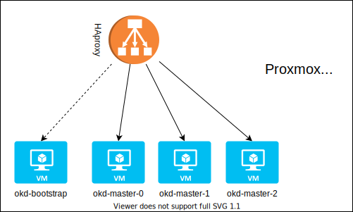

# ansible-okd-proxmox
Ansible playbook and roles for easy install OKD on Proxmox using qcow2 images and templates.

It's the ansible version of this other project: https://github.com/pvelati/okd-proxmox-scripts

The scripts will help deploying 3 nodes okd 4.5 cluster

## Requirements
* Proxmox 6.x
* Enough resources 
  * CPU: 16 vcpu (at least 12vcpu, 4 for each master node)
  * RAM: 64 GB (32GB should be ok)
  * DISK: 500 GB (possibly SSD, better NVME)
* DHCP reservation for nodes
* DNS entries for nodes and haproxy
* Ansible 2.10.x installed on a machine that is not Proxmox (or Proxmox if you want, I don't care)

### Optional
* Pull-secret downloaded from RH: https://cloud.redhat.com/openshift/install/pull-secret

## Installation
Clone repository where you want
>git clone https://github.com/pvelati/ansible-okd-proxmox

## Steps
### 0. Fecth collection and install pip packaged
>pip install --user -r requirements.txt

>ansible-galaxy install  -r requirements.yaml
### 1. Change variables for your environment
In those files:
* group_vars/all/vars
* group_vars/all/vault (in this repo is not encrypted, but it should be)
* inventory
### 2. Execute playbook
>ansible-playbook site.yaml
### 3. Check bootstrap execution
>openshift-install wait-for bootstrap-complete --dir=~/okd/ignitions/

And wait for completion. After that you can stop and delete bootstrap vm.
### 4. Check install status
>openshift-install wait-for install-complete --dir=~/okd/ignitions/

And wait for completion.

## Next steps not managed by playbook
1. Storage
2. Deployments
## Extra tools
No extra tools, you can use the shell scripts from other repo